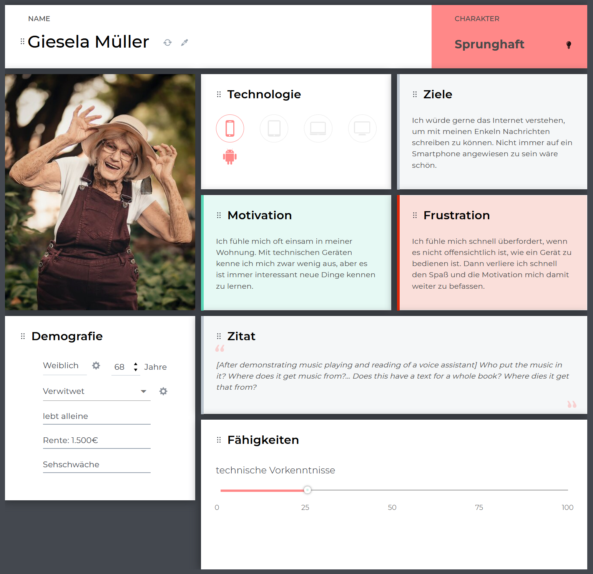
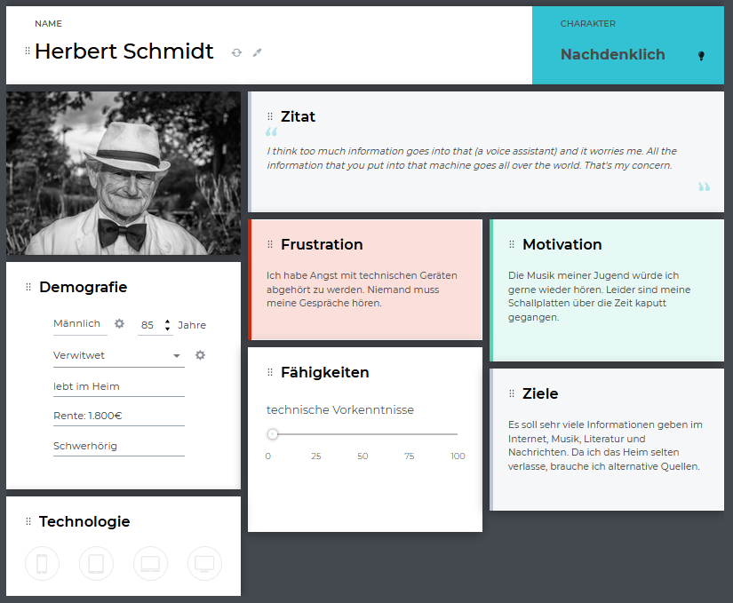

:toc: macro
:toc-title: Inhaltsvezeichnis
:project_name: Individualisierbare Sprachinteraktion

= {project_name}: Forschungsteil 

== Aufgabenstellung und Zielsetzung
Analyse und Forschung zur Entwicklung eines, für die Zielgruppe älterer Menschen
anwendbaren, Adaptionskonzepts für Sprachinteraktion basierend auf der Konfiguration von Feature-Modellen und der Konfigurationsauswahl durch ein Recommender-System.

== Inhaltsverzeichnis
toc::[]
:numbered:

== Einleitung

=== Motivation und Ziel
In den letzten Jahrzehnten entwickelten sich technische Systeme zunehmend schneller. Den Nutzern werden dabei immer neue Möglichkeiten geboten, mit der virtuellen Welt in Kontakt zu treten. Ob über den Computer, das Smartphone, den Fernseher oder die Armbanduhr, die Verbindung zum Internet ist ein stetiger Begleiter im Alltag. Doch mit zunehmender technologischer Entwicklung werden die Geräte nicht nur vielseitiger, sondern komplexer zu bedienen. Insbesondere für ältere Menschen stellt dies eine Hürde dar, welche viele von der Nutzung abschreckt.
Um den Zugang zu modernen Technologien zu vereinfachen, soll daher im Rahmen dieses Forschungsprojektes ein Adaptionskonzept entworfen werden. Zugeschnitten auf die Bedürfnisse von Senioren, soll dies die initiale Konfiguration des Systems ersetzen. So würde zum einen der Einstieg zur Benutzung des Systems erleichtert werden, ebenso wie das individuelle Nutzererlebnis verbessert werden.
Wir haben uns zu der Umsetzung am Beispiel eines Sprachassistenten entschieden, da dieser durch die Hand- und Augen-Freie Interaktion nicht nur zwei potenzielle Barrieren umgeht, sondern durch variable Skills viel Potential bietet, die Unabhängigkeit älterer Menschen zu unterstützen.

=== Aufbau
Das Adaptionskonzept soll eine Zuordnung von Nutzerprofilen zu Systemkonfigurationen ermöglichen. Zu Beginn erfolgte eine Zielgruppenanalyse, worauf basierende Personas und Anforderungen an Sprachinteraktion extrahiert wurden. Aufgrund dieser Informationen wurde ein Feature Modell erstellt und die Attribute des Profils ausgearbeitet, welche mittels eines Recommender-Systems zugeordnet werden sollen. Dies basiert auf einem KNN-Algorithmus, welcher mit Trainingsdaten angelernt werden sollte. Dafür wurden Testdaten anhand der Nutzeranalyse konzipiert, welche aus Zuordnungen von Profil und Konfiguration bestehen. 

== Spezifikation der Zielgruppe 
:hardbreaks-option:
Mehr und mehr Menschen erreichen ein höheres Alter. Allein in Deutschland stieg der prozentuale Anteil von Erwachsenen über 65 Jahren in den letzten Jahrzehnten stetig an [23]. Während Senioren im Jahr 2000 bereits 17% der Bevölkerung ausmachten, erhöhte sich diese Quote bis 2020 auf 22%. Bei einer Gesamtbevölkerung von circa 83,2 Millionen Menschen, umfasst diese Gruppe etwa 18,3 Millionen [22].

image::graphics/Pop-Table2.png[]

Mit der Größe der Zielgruppe steigt nicht nur die Vielseitigkeit der Charakteristika und Anforderungen. Der Prozess des Alterns verändert die physischen und psychosozialen Fähigkeiten des Menschen. In unterschiedlicher Geschwindigkeit und Verhältnis schwinden die Funktionen und bilden ein variables Merkmalsmuster, welches die Zielgruppe der Senioren beschreibt [31]. Die Akzeptanz bezüglich der Nutzung neuer Technologien, sowie der empfundenen Brauchbarkeit steht dabei in direkter Relation zu physischen, psychosozialen sowie soziodemografischen Faktoren. [6, 10, 24]

Im Alter verändern sich Wahrnehmung, Kognition, Bewegung und die sozialen Eigenschaften eines Menschen. Dadurch wandeln sich nicht nur die Bedürfnisse, sondern auch ihre Fähigkeiten zur Nutzung einer Technologie oder eines technischen Gerätes [24]. Beispielsweise verwenden Senioren mit physischen Seh-, Hör- und Bewegungsstörungen weniger Technologien als Menschen ohne Einschränkungen. Einen nicht minder relevanten Einfluss auf die Nutzung technischer Geräte spielen die kognitiven Fähigkeiten älterer Menschen. Je höher die kristalline und fluide Intelligenz eines Menschen, desto leichter fällt ihm der Umgang mit neuen Technologien.[6] Doch auch das soziale Umfeld und die Lebensumstände sind wichtige Faktoren.

=== Demografische Daten
==== Wohnsituation
Ungefähr die Hälfte der Senioren innerhalb der EU lebt mit dem Partner, beziehungsweise der Partnerin in einem Haushalt. Fast ein Drittel gab an, allein zu leben und etwa 20% leben in einer anderen Art der Gemeinschaft, beispielsweise mit Familienangehörigen oder im Heim. [23]

image::graphics/Wohnen_Frauen.png[]
image::graphics/Wohnen_Männer.png[]

==== Einkommen
Durch den Eintritt ins Rentenalter ändert sich für viele Senioren die primäre Einkommensquelle. Fortan beziehen sie ihr Geld aus der Rente/Pension, aus Einkünften von Angehörigen, durch eigene Erwerbstätigkeiten, oder sogar Sozialhilfe. 88% der Senioren finanzierten sich 2014 über ihre Rente. Zwischen Männern und Frauen gab es dabei deutliche Unterschiede, so waren sie deutlich häufiger von Angehörigen abhängig, da die Höhe der gesetzlichen Altersrente (Stand 2014) für Frauen deutlich geringer ausfiel als für Männer. [23]

image::graphics/Einkommen_Allein.png[]
image::graphics/Einkommen_Paar.png[]

==== Bildungsstand
Stand 2014 hatten nur 15% der älteren Deutschen das Abitur oder die Fachhochschulreife. Die Mehrheit bildeten mit 61% diejenigen mit einem Haupt- oder Volksschulabschluss. Besonders deutlich wird, dass der Anteil an Hochschulabschlüssen bei Männern höher ist als bei Frauen. Umgekehrt hatten mehr Frauen keinen Abschluss als Männer. [23]

image::graphics/Bildungsstand.png[]

==== Gesundheitszustand
Viele Senioren innerhalb Europas sind zufrieden mit ihrem Gesundheitszustand. Im Jahr 2014 empfanden 46% der EU-Bürger im Alter zwischen 65 und 74 Jahren den eigenen Gesundheitszustand als gut oder sehr gut, in Deutschland waren es sogar 49%. Mit steigendem Alter sank dieses Empfinden, so erfreuten sich nur noch 21% der 85-Jährigen einer guten oder sehr guten Gesundheit, in Deutschland nur 15%. Allgemein waren Männer durchschnittlich eher zufrieden mit ihrer Gesundheit als Frauen. [23]

Die Gesundheit wird von diversen Faktoren beeinflusst, sowohl das persönliche Verhalten, die genetische Veranlagung als auch das Lebensumfeld spielen dabei eine Rolle. Durch Umfragen ließ sich eine direkte Verbindung zwischen dem Bildungsstand, dem Einkommen und der empfundenen Gesundheit herstellen. [23]

image::graphics/Gesundheit.png[]

Sowohl der körperliche Zustand als auch das Einkommen und der Bildungsstand haben Auswirkungen auf die Nutzung neuer Technologien [24]. Generell treffen Menschen mit schlechter Gesundheit, eher auf Barrieren bezüglich Technik. Ob schlechtes Sehvermögen, Hörschwierigkeiten oder Mobilitätseinschränkungen, jede Hürde muss in der Entwicklung berücksichtigt werden.

=== Physische Charakteristiken
==== Visuelle Wahrnehmung
Typische Probleme im Alter sind abnehmende Seh- und Hörfähigkeiten. Schwierigkeiten der visuellen Wahrnehmung betreffen hauptsächlich das räumliche Sehen, also Schärfe und Kontrastempfindlichkeit, das Sehvermögen in schwachem Licht, die Verarbeitung von Farbinformationen, Anpassbarkeit an Reflektionen und Blendung, eine langsamere Verarbeitung der gegebenen visuellen Informationen und ein eingeschränktes Sichtfeld. [18]

==== Auditive Wahrnehmung 
Altersbedingte Schwerhörigkeit umfasst eine langsamere auditive Verarbeitung, ein vermindertes Hörvermögen höherer Frequenzen, Hörschwierigkeiten in lauten Umgebungen und ein vermindertes Verständnis von sowohl normaler als auch verzerrter Sprache. [11]
Sowohl das Hörvermögen als auch das Sehen sind essenzielle "soziale Sinne", welche einen Großteil der zwischenmenschlichen Informationsübertragung bewerkstelligen. Die Veränderung dieser Fähigkeiten beeinträchtigt eine Vielzahl von Aktivitäten wie beispielsweise das Lesen und allgemeine Kommunikation, was sich wiederum negativ auf die Benutzerfreundlichkeit neuer Technologien auswirken kann.

==== Somatosensorik
Auch die haptische Wahrnehmung der physischen Umgebung lässt nach. So fällt es vielen Senioren zunehmend schwieriger Texturen, Rauheit und Spannung von Oberflächen präzise zu ertasten, auch die räumliche Schärfe verschlechtert sich [25]. Die Notwendigkeit diskreter Bewegungen, wie beispielsweise das Antippen kleiner Ziele, drücken von schmalen Knöpfen oder das Schreiben mit einem Stift, kann daher bereits eine Barriere im Umgang mit technischen Geräten darstellen.

==== Motorik
Die Knochenmasse sowie der Muskel- und Muskelfaseranteil reduzieren sich bis zum 80. Lebensjahr um etwa 50%. In Bezug auf die neurologischen Systeme steht der altersbedingte Rückgang im Zusammenhang mit einer beeinträchtigten Leistung der Fein- und Grobmotorik [21]. Dies führt zu erhöhten Reaktionszeiten im Vergleich zu jüngeren Erwachsenen (mindestens 25%).

==== Kognition 
Eine Metaanalyse von 91 Studien bestätigte eine nichtlineare Beschleunigung des altersbedingten Rückgangs der Kognition ab dem fünfzigsten Lebensjahr [27]. Diese ist dabei in verschiedenen Teilaspekten zu betrachten.

===== Episodisches Gedächtnis
Älteren Erwachsenen fällt es schwer, sich an Details zu erlebten Ereignissen zu erinnern, wie z. B. eine bestimmte Zeit oder einen bestimmten Ort, während sie sich relativ leicht an allgemeine Informationen zu vergangenen Erfahrungen erinnern können [12]

===== Semantisches Gedächtnis/ kristallisiertes Wissen
Bis etwa zum 80. Lebensjahr erweitert sich das Gedächtnis an Faktenwissen mit guten Bildungshintergründen. Ab einem Zeitraum zwischen dem 80. und 90. Lebensjahr beginnt sich diese Aufnahmefähigkeit langsam zu verringern [17].

===== Verfahrensgedächtnis
Sobald der Vorgang einer bestimmten motorischen Fähigkeit im Gedächtnis gespeichert ist, kann er unabhängig vom Alter bei Bedarf automatisch verwendet werden [16].

===== Prospektives Gedächtnis
Dies beschreibt die Fähigkeit, sich zur richtigen Zeit selbstständig daran zu erinnern, eine geplante Handlung auszuführen, beispielsweise eine Verabredung einzuhalten. Es nimmt im Alter ab. [26]

===== Arbeitsgedächtnis
Zuständig für die kurzfristige Informationsspeicherung und Verarbeitung, sowie komplexen kognitiven Aufgaben wie das Sprachverständnis. Im Alter zeigen sich sowohl Defizite im verbalen Gedächtnis als auch im Visuell-Räumlichen, sowie Schwierigkeiten bei der Wiedererkennungsleistung [2].

=== Psychosoziale Charakteristiken
==== Priorisierung im Alter
Der Übergang zwischen verschiedenen Lebensphasen führt auch im Alter zu einer Verschiebung der Strategie und Motivation des selektiven Verhaltens [7]. Die Priorisierung bestimmten Verhaltens und Einstellungen wird durch verschiedene Modelle und Theorien mit unterschiedlichen Ansätzen beschrieben.
Die sozioemotionale Selektivitätstheorie besagt, dass die Wahrnehmung der verbleibenden Lebenszeit einen starken Einfluss auf die Lebensmotivation hat. Zudem geht sie davon aus, dass Lebensziele in zwei Kategorien eingeteilt werden können: Erstens Ziele, die mit dem Suchen nach Wissen verbunden sind und zweitens diejenigen, die mit emotionaler Regulierung verbunden sind. Langfristig betrachtet verfolgen Menschen mit großer verbleibender Lebensspanne mit hoher Wahrscheinlichkeit eher wissenssuchende Ziele als emotionale. Im Gegensatz dazu verschiebt sich die Priorität bei begrenzter Lebensspanne auf emotionale Ziele.
Beispielsweise kontaktieren ältere Erwachsene häufiger ihre engen Freunde oder Verwandten. Da die Kontaktqualität wichtiger bemessen wird als die Kontaktquantität, schwindet häufig der Kontakt zu Bekannten. [4]

==== Geistiges Wohlbefinden
Ältere Erwachsene unterliegen einem erhöhten Risiko bezüglich ihrer psychischen Gesundheit, so leiden etwa 15% aller Senioren unter einer psychischen Störung [28]. Es wurde argumentiert, dass Risiken für das psychische Wohlbefinden in hohem Maße mit sozialer Isolation und Einsamkeit verbunden sind, was zu Depressionen, Angstzuständen und sogar Sterblichkeit führen kann. Eine metaanalytische Überprüfung von 70 Studien mit 3.407.134 Teilnehmern, die 7 Jahre lang untersucht wurden, berichtete, dass soziale Isolation und Einsamkeit die Sterblichkeitsrate um durchschnittlich 29 % bzw. 26 % erhöhten [8].

==== Soziale Beziehungen
Soziale Isolation tritt bei Senioren häufiger auf als bei jüngeren Menschen, oft begleitet von einer allgemeinen Verschlechterung des Gesundheitszustandes. Im Alter werden soziale Beziehungen selektiver, so wird eine enge Bindung zu Familienmitgliedern stark bevorzugt vor neuen Bekanntschaften [5]. Beispielsweise haben Kinder und Enkelkinder in der Regel einen größeren Einfluss auf die Akzeptanz und Verwendung neuer technischer Geräte, als Fremde oder Verkäufer [14]. Um sozialer Isolation vorzubeugen, ist eine Verbesserung der Kommunikation nötig, sowie ein Netzwerk sozialer Unterstützung. Negative Gefühle und Einstellungen älterer Menschen gegenüber dem Leben nach dem Ruhestand können durch die Nutzung des Internets verbessert werden [29].

=== Personas
Anhand der Erkenntnisse der Nutzeranalyse wurden Personas erstellt, um die Zielgruppe besser veranschaulichen zu können. 

image::graphics/Persona-3.png[]
image::graphics/Persona-4.png[]

[12] Personas

== Features des Sprachassistenten
:hardbreaks-option:
Anhand der Nutzeranalyse wurde ein Feature Modell konzipiert, welches die möglichen Anpassungen des Systems an den Nutzer umfasst. Der Fokus der Features liegt auf der Kommunikationsweise des Sprachassistenten, nicht auf den Aufgaben, die er erfüllen könnte.
Das Ziel ist es, durch eine bestmöglich vorgeschlagene Konfiguration die Akzeptanz des Nutzers gegenüber dem System zu erhöhen und seinen allgemeinen Umgang mit dem VA zu erleichtern und zu verbessern. Daher wurden anhand des Nutzermodells, sowie zusätzlichen Studiendaten Auswahlmöglichkeiten definiert, welche eine möglichst barrierefreie Interaktion der Zielgruppe ermöglichen sollen.
Das Feature Modell wurde in drei Teilbäume unterteilt, welche jeweils verwandte oder zusammenhängende Merkmale gruppieren.

image::graphics/FeatureModel.png[]

=== Stimme
Der Teilbaum der Stimme umfasst das Tongeschlecht, den Pitch, den Klang, sowie die Lautstärke. Die Variabilität dieser Merkmale ist vor allem für Menschen mit Hörhilfe essenziell, um ein barrierefreies Sprachverständnis zu gewährleisten.

image::graphics/FM_Stimme.png[]

==== Geschlecht
Das Stimmgeschlecht steht entweder als weiblich oder männlich zur Auswahl. Zwar wird tendenziell eine männliche Stimme bevorzugt, doch Ausnahmen, beispielsweise zwecks Identifizierung, erfordern die mögliche Auswahl einer weiblichen Stimme.
[3] Alter 76-94, Durchschn.: 87
[19] 8 Senioren, Durchschn.: 79

==== Tonlage (Pitch)
Die durchschnittliche Tonlage liegt für eine weibliche Stimme im Bereich von etwa 143-285 Hz mit einem Mittelwert von 211 Hz, für männliche Stimmen liegt sie bei 86-152 Hz mit einem Mittelwert von 110 Hz. Zusätzlich besteht die Möglichkeit den Pitch um 10% zu erhöhen oder zu senken um das Sprachverständnis zu erleichtern. Besonders für Hörgeschädigte ist eine Anpassung der Tonlage essenziell.
[3] Alter 76-94, Durchschn.: 87
[1] Alter 53-63, hörgeschädigt mit Hilfsmittel
[20] 

==== Klang
Der Klang der Stimme kann entweder natürlich oder synthetisch gewählt werden, häufig wurde eine natürliche Stimme der synthetischen vorgezogen.
[19] 8 Senioren, Durchschn.: 79
[13] 32 Senioren älter 65

==== Lautstärke
Für Umgangssprache liegt die wahrgenommene Lautstärke bei etwa einem Meter Abstand bei 60 bis 65 dB, beim Flüstern um 30 dB. Anhand dessen wurde eine Lautstärkeskala zur Einstellung des Sprachassistenten festgelegt: 
1 = 40 dB
2 = 50 dB
3 = 60 dB
4 = 70 dB
5 = 80 dB
[1] Alter 53-63, hörgeschädigt mit Hilfsmittel
[9] 

=== Spracheigenschaften
Die Spracheigenschaften definieren die Sprechweise in ihrem Ausdruck, der Satzlänge, möglichen Pausen zwischen den Sätzen und die Sprechgeschwindigkeit. Besonders im höheren Alter, mit nachlassenden kognitiven Fähigkeiten, ist eine Anpassung dieser Attribute sinnvoll.

image::graphics/FM_Spracheigenschaften.png[]

==== Pause zwischen den Sätzen
Da Senioren im Vergleich zu jungen Erwachsenen länger brauchen, um Sprache zu verarbeiten, besteht die Notwendigkeit den Sprachfluss zu verlangsamen. Dafür soll es ermöglicht werden die Pausen also die Zeit im normalen Sprachfluss zwischen zwei Sätzen zu verlängern. Hierbei besteht die Auswahl zwischen keiner Pause (normaler Sprachfluss), einer kurzen (anderthalbfache Pause), oder einer langen (doppelten) Pause zwischen den Sätzen. 
[15] ISO

==== Sprechgeschwindigkeit
Die definierte durchschnittliche Sprechgeschwindigkeit beträgt 140-170 Wörter pro Minute. Mit schwindenden kognitiven Fähigkeiten oder Schwerhörigkeit ist potenziell eine Verlangsamung nötig. Nach einer Studie wurde eine Reduzierung um 10% der durchschnittlichen Geschwindigkeit als verständlich empfunden.  
[3] Alter 76-94, Durchschn.: 87
[15] ISO
[1] Alter 53-63, hörgeschädigt mit Hilfsmittel

==== Satzlänge
Die Auswahl der Satzlänge entscheidet über die Verwendung konkatenierter Sätze. Diese bieten, besonders im Fall von älteren Erwachsenen mit Hörschwäche, Potenzial Wörter zu überhören. 
[1] Alter 53-63, hörgeschädigt mit Hilfsmittel

==== vereinfachter Ausdruck
Im hohen Alter schwindet die Aufnahmefähigkeit wodurch es Menschen schwieriger fallen kann Gesprächen zu folgen. Besonders lange Sätze mit ausschweifendem Vokabular erschweren es Ansagen im Gedächtnis zu behalten. Die zusätzliche Option des vereinfachten Ausdrucks soll somit einen adaptiven Sprachfluss ermöglichen.
[30] 30 Senioren Durchschn.: 81

=== Kommunikationsstil
Der Zweig des Kommunikationsstil fasst die Sprache, Gesprächsorientierung, Anrede und die Möglichkeit zu alternativen Keywords zusammen. Dies dient primär zur Personalisierung des Sprachassistenten.

image::graphics/FM_Kommunikationsstil.png[]

==== Sprache
Die Systemsprache richtet sich nach der Sprache des Nutzers.

==== Gesprächsorientierung
Die Kommunikationsweise zwischen Nutzer und Sprachassistenten kann entweder aufgabengebunden, also ehr prägnant, oder sozial orientiert und damit ehr ausschweifend sein. Dies lässt den Nutzer selbst über die Rolle des VA entscheiden, ob dieser als Gesprächspartner fungiert oder als Mittel zum Zweck dient.

==== Anrede
Je nach persönlicher Präferenz steht es dem Nutzer offen das System in der Du- oder Sie-Form kommunizieren zu lassen. Zwar wird die Du-Form bevorzugt, jedoch neigen manche Senioren zu längeren und höflicheren Kommandos als jüngere Nutzer.
[19] 8 Senioren, Durchschn.: 79

==== alternative Keywords
Es soll die Möglichkeit geboten werden Schlüsselbegriffe zur Steuerung des Systems zu ersetzen, um nicht mit den Sprachgewohnheiten des Nutzers zu brechen. Durch den kognitiven Verfall mit zunehmendem Alter schwindet die Anpassungsfähigkeit des Nutzers. Senioren mit Dialekt können somit den Sprachassistenten an ihren Ausdruck anpassen.

== Trainingsdaten
Zur Lösung des sogenannten Kaltstartproblems des Recommenders wurden Testdaten erstellt. Diese setzen sich aus dem Nutzerprofil und einer zugehörigen Konfiguration zusammen und basieren auf den Personas des Nutzermodells und Daten aus Studien.

=== Profil
Das Nutzerprofil umfasst die in der Tabelle aufgeführten Attribute zur Beschreibung des Nutzenden. Es dient zur Beschreibung des Anwenders und zur Zuordnung für das Recommender-System. Die ID, der Name und die alternativen Keywords dürfen nicht in das Matching-Verfahren mit einbezogen werden, da sie nur bedingt mit der Konfigurationsauswahl in Verbindung stehen.
[%header, cols="1, 1, 1"]
|===
|Attribut
|Beispiel
|Beschreibung

|ID
|id
|Zuordnen zwischen Profil und Konfiguration

|Name
|Mustername
|Name des Nutzers. Darf nicht als Attribut zur Zuordnung verwendet werden.

|Geschlecht
a| * Männlich
   * Weiblich 
   * Diverse
|Geschlecht des Nutzers

|Alter
|≥ 65
|Alter des Nutzers
   
|Sprache
a| * Deutsch
   * Englisch
|Systemsprache 

|Hörgerät
a| * Ja
   * Nein
|Verwendung eines Hörgerätes durch den Nutzer

|technische Vorkenntnisse
a| * Ja
   * Nein
|Technisches Vorwissen des Nutzers

|===

=== Konfiguration
Die Konfiguration beinhaltet die in der Tabelle aufgeführten Merkmale des Feature Modell. 

[%header, cols="1, 1"]
|===
|Konfiguration
|Wert

|ID
|ID

|Geschlecht
a| * Männlich
   * Weiblich

|Tonlage
a| * Tief
   * Mittel
   * Hoch

|Klang
a| * Natürlich
   * Synthetisch
   
|Lautstärke
a| * 1
   * 2
   * 3
   * 4
   * 5

|Pause zwischen den Sätzen
a| * Keine
   * Kurz
   * Lang

|Sprechgeschwindigkeit
a| * Langsam
   * Durchschnittlich

|Satzlänge
a| * Normal
   * Vereinfacht

|vereinfachter Ausdruck
a| * Ja
   * Nein

|Sprache
a| * Deutsch
   * Englisch

|Gesprächsorientierung
a| * Aufgaben orientiert
   * Sozial orientiert

|Anrede
a| * Sie
   * Du

|alternative Keywords
a| * -
   * Licht an = Beispiel
|===

=== Zuordnung von Charakteristiken zu Features
Anhand von Studiendaten konnten Verbindungen zwischen bestimmten Eigenschaften des Nutzers und Konfigurationsdetails belegt werden. Da dies jedoch nicht für alle Features möglich war, wurde zusätzlich eine Default Konfiguration erstellt, welche die allgemeingültigste Auswahl symbolisiert. 

==== Tonlage (Pitch)
Senioren mit eingeschränktem Hörvermögen, insbesondere unter der Verwendung von Hörgeräten oder Implantaten, zeigten Probleme hohe Tonlagen zu verstehen. Tiefe Stimmen wurden daher als besonders angenehm und verständlich wahrgenommen. 
[3] Alter 76-94, Durchschn.: 87
[1] Alter 53-63, hörgeschädigt mit Hilfsmittel

==== Sprechgeschwindigkeit
Eine durchschnittliche bis hohe Sprechgeschwindigkeit stellt für Ältere mit Hörschaden eine potentielle Barriere zur Systemnutzung dar, daher besteht die Notwendigkeit der Verringerung. 
[3] Alter 76-94, Durchschn.: 87
[15] ISO
[1] Alter 53-63, hörgeschädigt mit Hilfsmittel

==== Satzlänge
Für Hörgeschädigte ist zudem die Satzlänge zu verringern, da konkatenierte Sätze mehr Potential bieten Wörter zu überhören.
[1] Alter 53-63, hörgeschädigt mit Hilfsmittel

==== vereinfachter Ausdruck
Ab einem Alter von ca 80 Jahren beginnt das kristalline Gedächtnis zu schwinden, einfache Aussagen sind daher leichter im Gedächtnis zu behalten.
[30] 30 Senioren Durchschn.: 81
[17] 

==== Default Konfiguration
[%header, cols="1, 1, 1"]
|===
|Default Konfiguration
|
|

|ID
|ID
|

|Geschlecht
|Männlich
|Männliche Stimme oft bevorzugt vor Weiblicher [3]

|Tonlage
|Normal
|Normale Tonlage ohne Hörschaden verständlich [1, 3]

|Klang
|Natürlich
|Natürlich deutlich bevorzugt vor synthetisch [19, 13]
   
|Lautstärke
|3
|Durchschnittliche Lautstärkeeinstellung [15]

|Pause zwischen den Sätzen
|Kurz
|Anderthalbfache Reaktionszeit und Pause fördern das Verständnis [15]

|Sprechgeschwindigkeit
|Durchschnittlich
|Durchschnittliche Sprechgeschwindigkeit gut verständlich ohne Hörschaden [3, 15, 1]

|Satzlänge
|Normal
|Nur für Hörgeschädigte zu vereinfachen [1]

|vereinfachter Ausdruck
|Nein
|Erst im hohen Alter nötig zu vereinfachen [30]

|Sprache
|Deutsch
|

|Gesprächsorientierung
|Aufgaben orientiert
|Tendenziell wird der Sprachassistent als mittel zum Zweck betrachtet. [19]

|Anrede
|Du
|Du-Form bevorzugt vor Sie-Form [19]

|alternative Keywords
|-
|
|===

=== Beispiel
Basierend auf den Anforderungsanalyse der Zuordnung von Charakteristiken zu Merkmalen, der Default Konfiguration, sowie den Erkenntnissen der Nutzeranalyse wurden etwa 550 Testdaten geschrieben. Um dies zu Veranschaulichen wurden im Folgenden die Persona des Usermodell aufgegriffen und entsprechende Testdaten zugeordnet. 

==== Giesela Müller

[%header, cols="1, 1"]
|===
|Profil
|

|ID
|2

|Name
|Giesela Müller 

|Geschlecht
|weiblich 

|Alter
|68
   
|Sprache
|Deutsch

|Hörgerät
|nein

|technische Vorkenntnisse
|ja

|alternative Keywords
|-
|===

[%header, cols="1, 1"]
|===
|Konfiguration
|

|ID
|2

|Geschlecht
|männlich

|Tonlage
|normal

|Klang
|natürlich
   
|Lautstärke
|3

|Pause zwischen den Sätzen
|kurz

|Sprechgeschwindigkeit
|durchschnittlich

|Satzlänge
|normal

|vereinfachter Ausdruck
|nein

|Sprache
|Deutsch

|Gesprächsorientierung
|Aufgaben orientiert

|Anrede
|Du

|alternative Keywords
|-
|===

==== Herbert Schmidt

[%header, cols="1, 1"]
|===
|Profil
|

|ID
|4

|Name
|Herbert Schmidt

|Geschlecht
|männlich 

|Alter
|85
   
|Sprache
|Deutsch

|Hörgerät
|ja

|technische Vorkenntnisse
|nein

|alternative Keywords
|-
|===

[%header, cols="1, 1"]
|===
|Konfiguration
|

|ID
|4

|Geschlecht
|männlich

|Tonlage
|tief

|Klang
|natürlich
   
|Lautstärke
|3

|Pause zwischen den Sätzen
|kurz

|Sprechgeschwindigkeit
|langsam

|Satzlänge
|vereinfacht

|vereinfachter Ausdruck
|ja

|Sprache
|Deutsch

|Gesprächsorientierung
|Aufgaben orientiert

|Anrede
|Du

|alternative Keywords
|-
|===

==== Otto Becker
image::graphics/Persona-3.png[]

[%header, cols="1, 1"]
|===
|Profil
|

|ID
|1

|Name
|Otto Becker

|Geschlecht
|männlich 

|Alter
|73
   
|Sprache
|Deutsch

|Hörgerät
|ja

|technische Vorkenntnisse
|ja

|alternative Keywords
|-
|===

[%header, cols="1, 1"]
|===
|Konfiguration
|

|ID
|1

|Geschlecht
|männlich

|Tonlage
|tief

|Klang
|natürlich
   
|Lautstärke
|3

|Pause zwischen den Sätzen
|kurz

|Sprechgeschwindigkeit
|langsam

|Satzlänge
|vereinfacht

|vereinfachter Ausdruck
|nein

|Sprache
|Deutsch

|Gesprächsorientierung
|Aufgaben orientiert

|Anrede
|Du

|alternative Keywords
|-
|===

==== Lieselotte Meier
image::graphics/Persona-4.png[]

[%header, cols="1, 1"]
|===
|Profil
|

|ID
|3

|Name
|Lieselotte Meier

|Geschlecht
|weiblich 

|Alter
|92
   
|Sprache
|Deutsch

|Hörgerät
|nein

|technische Vorkenntnisse
|ja

|alternative Keywords
|-
|===

[%header, cols="1, 1"]
|===
|Konfiguration
|

|ID
|3

|Geschlecht
|männlich

|Tonlage
|tief

|Klang
|natürlich
   
|Lautstärke
|3

|Pause zwischen den Sätzen
|kurz

|Sprechgeschwindigkeit
|durchschnittlich

|Satzlänge
|normal

|vereinfachter Ausdruck
|ja

|Sprache
|Deutsch

|Gesprächsorientierung
|Aufgaben orientiert

|Anrede
|Du

|alternative Keywords
|-
|===

== Zusammenfassung und Ausblick
Die Nutzung moderner Technologien bietet sowohl Herausforderungen als auch Möglichkeiten, um den Alltag älterer Menschen zu bereichern. Die vielfältigen und variablen Anforderungen der Senioren erfordern die Möglichkeit das System an ihre Bedürfnisse anzupassen.
Im Rahmen dieser Arbeit wurde dazu ein Adaptionskonzept entwickelt, welches die initiale Konfiguration eines Sprachassistenten anhand eines Nutzerprofils vornimmt. Durch umfassende Recherche wurde eine Nutzeranalyse vollzogen, anhand derer Anforderungen an einen Sprachassistenten abgeleitet werden konnten. Diese fokussierten sich besonders auf den Ausgleich der häufig schwindenden auditiven Wahrnehmung sowie dem Rückgang kognitiver Funktionen.  Das entstandene Feature-Modell gruppiert die verschiedenen Merkmale in Teilbäume für Stimme, Spracheigenschaften und Kommunikationsstil. Zusätzlich dazu wurde ein Nutzerprofil erstellt, welches zuordnungsrelevante Charakteristika des Nutzers erfasst. 
Die Zuordnung von Profilen zu Konfigurationen erfolgt mittels eines Recommender-Systems, basierend auf dem KNN-Algorithmus. Um diesen Anzulernen wurden Testdaten erstellt, welche die Ergebnisse der Nutzeranalyse aufgriffen, um konkrete Zuordnungen zwischen Charakteristika (beispielweise ein verringertes Hörvermögen) und Feature (der Tonlage) einzubeziehen. Da nicht für jede Teilkonfiguration eine konkrete Zuordnung zu einer Anforderung belegt werden konnte, wurde eine Default Konfiguration erstellt, welche die allgemeingültigste Auswahl realisiert.

Da die bisherige Zuordnung des Recommender-Systems auf recherchierten Daten basiert, sollte dies durch eine Nutzerstudie evaluiert und weiterentwickelt werden. Mittels empirischer Daten könnte zum einen eine präzisere Zuordnung von Profil und Konfiguration realisiert werden, zudem würde es eine Überprüfung und eventuelle Anpassung der Features ermöglichen.  Aufbauend darauf könnte das Konzept auf verschiedene moderne Technologien erweitert werden, um Senioren den Umgang mit diesen zu erleichtern.

== Literatur
:hardbreaks-option:

[1] Johnna Blair and Saeed Abdullah. Understanding the needs and challenges of using conversational agents for deaf older adults. In Eric Gilbert and Karrie Karahalios, editors, Conference Companion Publication of the 2019 on Computer Supported Cooperative Work and Social Computing, pages 161–165, New York, NY, USA, 2019. ACM.

[2] Kara L. Bopp and Paul Verhaeghen. Aging and verbal memory span: a meta-analysis. The journals of gerontology. Series B, Psychological sciences and social sciences, 60(5):P223-33, 2005.

[3] Robin Brewer, Raymundo Cornejo Garcia, Tedmond Schwaba, Darren Gergle, and Anne Marie Piper. Exploring traditional phones as an e-mail interface for older adults. ACM Transactions on Accessible Computing, 8(2):1–20, 2016.

[4] L. L. Carstensen, D. M. Isaacowitz, and S. T. Charles. Taking time seriously. a theory of socioemotional selectivity. The American psychologist, 54(3):165-181, 1999.

[5] Susan Turk Charles and Jennifer R. Piazza. Memories of social interactions: age differences in emotional intensity. Psychology and Aging, 22(2):300-309, 2007.

[6] Sara J. Czaja, Neil Charness, Arthur D. Fisk, Christopher Hertzog, Sankaran N. Nair, Wendy A. Rogers, and Joseph Sharit. Factors predicting the use of technology: Findings from the center for research and education on aging and technology enhancement (create). Psychology and Aging, 21(2):333-352, 2006.

[7] Thomas M. Hess. Selective engagement of cognitive resources: Motivational influences on older adults cognitive functioning. Perspectives on psychological science : a journal of the Association for Psychological Science, 9(4):388-407, 2014.

[8] Julianne Holt-Lunstad, Timothy B. Smith, Mark Baker, Tyler Harris, and David Stephenson. Loneliness and social isolation as risk factors for mortality: a meta-analytic review. Perspectives on psychological science : a journal of the Association for Psychological Science, 10(2):227-237, 2015.

[9] Christiane Kiese-Himmel. Stimmapparat und stimmgebung. In Christiane Kiese-Himmel, editor, Körperinstrument Stimme, pages 9-18. Springer Berlin Heidelberg, Berlin, Heidelberg, 2016.

[10] Sunyoung Kim. Exploring how older adults use a smart speaker-based voice assistant in their first interactions: Qualitative study. JMIR mHealth and uHealth, 9(1):e20427, 2021.

[11] Fu-Shing Lee, Lois J. Matthews, Judy R. Dubno, and John H. Mills. Longitudinal study of pure-tone thresholds in older persons. Ear and hearing, 26(1):1-11, 2005.

[12] Brian Levine, Eva Svoboda, Janine F. Hay, Gordon Winocur, and Morris Moscovitch. Aging and autobiographical memory: dissociating episodic from semantic retrieval. Psychology and Aging, 17(4):677-689, 2002.

[13] L. Lines and K. S. Hone. Multiple voices, multiple choices: Older adults evaluation of speech output to support independent living. Gerontechnology, 5(2), 2006.

[14] Tuunainen VK. Mallenius S, Rossi M. Factors affecting the adoption and use of mobile devices and services by elderly people-results from a pilot study. 6th Annual Global Mobility Roundtable., pages 1-12, 2007.

[15] DIN-Normenausschuss Ergonomie (NAErg). Ergonomische daten und leitlinien für die anwendung des iso/iec guide 71 für produkte und dienstleistungen zur berücksichtigung der belange älterer und behinderter menschen (iso/tr 22411:2008). 2011.

[16] Lars-Göran Nilsson. Memory function in normal aging. Acta neurologica Scandinavica. Supplementum, 179:7-13, 2003.

[17] Lars Nyberg, Martin Lövdén, Katrine Riklund, Ulman Lindenberger, and Lars Bäckman. Memory aging and brain maintenance. Trends in cognitive sciences, 16(5):292-305, 2012.

[18] Cynthia Owsley. Aging and vision. Vision research, 51(13):1610–1622, 2011.

[19] François Portet, Michel Vacher, Caroline Golanski, Camille Roux, and Brigitte Meillon. Design and evaluation of a smart home voice interface for the elderly: acceptability and objection aspects. Personal and Ubiquitous Computing, 17(1):127-144, 2013.

[20] Daniel E. Re, Jillian J. M. O’Connor, Patrick J. Bennett, and David R. Feinberg. Preferences for very low and very high voice pitch in humans. PloS one, 7(3):e32719, 2012.

[21] Rachael D. Seidler, Jessica A. Bernard, Taritonye B. Burutolu, Brett W. Fling, Mark T. Gordon, Joseph T. Gwin, Youngbin Kwak, and David B. Lipps. Motor control and aging: links to age-related brain structural, functional, and biochemical effects. Neuroscience and biobehavioral reviews, 34(5):721-733, 2010.

[22] Statistisches Bundesamt (Destatis). Bevölkerungspyramide. Available online at: https://service.destatis.de/bevoelkerungspyramide/#!y=2020&a=18,65&v=2, last accessed on 21.03.2023.

[23] Statistisches Bundesamt (Destatis). Ältere menschen in deutschland und der eu. Available online at: https://www.destatis.de/DE/Themen/Gesellschaft-Umwelt/Bevoelkerung/Bevoelkerungsstand/Publikationen/Downloads-Bevoelkerungsstand/broschuere-aeltere-menschen-0010020169004.html, last accessed on 21.03.2023.

[24] M. Tacken, F. Marcellini, H. Mollenkopf, I. Ruoppila, and Z. Széman. Use and acceptance of new technology by older people. findings of the international mobilate survey: enhancing mobility in later life. Gerontechnology, 3(3), 2005.

[25] Francois Tremblay and Sabah Master. Touch in aging. In Tony Prescott, Ehud Ahissar, and Eugene Izhikevich, editors, Scholarpedia of Touch, pages 351–361. Atlantis Press, Paris, 2016.

[26] Bob Uttl. Transparent meta-analysis of prospective memory and aging. PloS one, 3(2):e1568, 2008.

[27] P. Verhaeghen and T. A. Salthouse. Meta-analyses of age-cognition relations in adulthood: estimates of linear and nonlinear age effects and structural models. Psychological bulletin, 122(3):231-249, 1997.

[28] WHO. Mental health of older adults. Available online at: https://www.who.int/news-room/fact-sheets/detail/mental-health-of-older-adults, last accessed on 21.03.2023.

[29] Bo Xie. Older chinese, the internet, and well-being. Care management journals : Journal of case management ; The journal of long term home health care, 8(1):33-38, 2007.

[30] M. Zajicek and W. Morrissey. Speech output for older visually impaired adults. In Ann Blandford, Jean Vanderdonckt, and Phil Gray, editors, People and Computers XV—Interaction without Frontiers, pages 503-513. Springer London, London, 2001.

[31] Mary Zajicek, Andrew Lee, and Richard Wales. Older adults and the usability of speech interaction. In Clarisse Sieckenius de Souza, Alfredo Sánchez, Simone Barbosa, and Cleotilde Gonzalez, editors, Proceedings of the Latin American conference on Human-computer interaction - CLIHC 03, pages 209-215, New York, New York, USA, 2003. ACM Press. 27