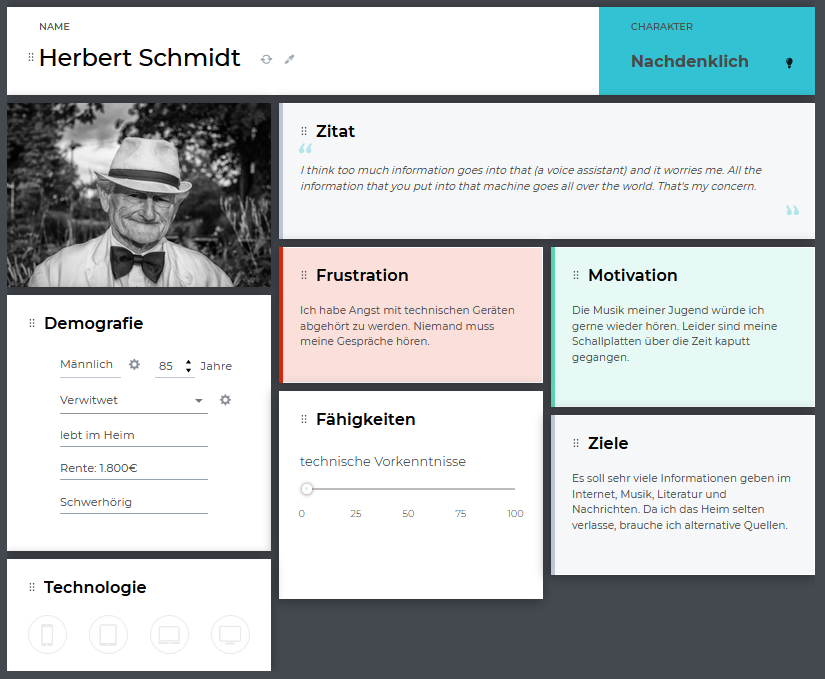

:toc: macro
:toc-title: Inhaltsvezeichnis
:project_name: Individualisierbare Sprachinteraktion

= {project_name}: Forschungsteil 

// Anmerkung:
// Das Dokument befindet sich noch in Arbeit und dient zunächst primär der Informationssammlung

== Aufgabenstellung und Zielsetzung
Analyse und Forschung zur Entwicklung eines, für die Zielgruppe älterer Menschen
anwendbaren, Adaptionskonzepts für Sprachinteraktion basierend auf der Konfiguration von Feature-Modellen und der Konfigurationsauswahl durch ein Recommender-System.

== Abstract

== Inhaltsverzeichnis
toc::[]
:numbered:

== Einleitung

=== Motivation und Ziel
// Warum wird sowas benötigt
In den letzen Jahrzehnten entwickeln sich technische Systeme zunehmend schneller. Den Nutzern werden dabei immer neue Möglichkeiten geboten mit der virtuellen Welt in Kontakt zu treten. Ob über den Computer, das Smartphone, den Fernsehr oder die Armbanduhr, die Verbindung zum Internet ist ein stetiger Begleiter im Alltag. Dch mit zumnehmender technologischer Entwicklung, werden die Geräte nicht nur vielseitiger, sondern komplexer zu bedienen. Insbesondere für ältere Menschen stellt dies eine Hürde dar welche viele von der Nutzung Abschreckt. 
Um den Zugang zu modernen Technologien zu vereinfachen, soll daher im Rahmen dieses Forschungsprojektes ein Adaptionskonzept entworfen werden. Zugeschnitten auf die Bedürfnisse von Senioren, soll dies die initiale Konfiguration des Systems ersetzen. So würde zum einen der Einstieg zur Benutzung des Systems erleichtert werden, ebenso wie das individuelle Nutzererlebniss verbessert werden.

Wir haben uns zu der Umsetzung am Beispiel eines Sprachassistenten entschieden, da dieser durch die Hand- und Augenfreie Interaktion nicht nur zwei potenzielle Barrieren umgeht, sondern durch Variable Skills viel Potential bietet, den Alltag der älteren Bevölkerung zu bereichern. 

=== Aufbau
// Wie ist die Erarbeitung aufgebaut
Das Adaptionskonzept soll mittels eines Recommendersystems, basierend auf einem KNN-Algorithmus, eine Konfiguration vorschlagen, welche auf der Zuordnung von Personendaten zu Features basiert. Dazu wird zuerst eine Zielgruppenanlyse erfolgen, worauf basierend Personas, Szenarien, Anwendungsfälle und Mentale Modelle erstellt werden. Anhand dessen wird ein Featuremodell erstellt und Trainingsdaten konzipiert, welche aus Zuordnungen aus paarweise Persona und Konfiguration bestehen.

== Hintergrund
// Was sind Sprachassistenten
// Senioren und Technik
// Evtl bisherige Arbeiten
TODOOO

== Spezifikation der Zielgruppe 
// Alle Charakteristiken der Zielgruppe aufgeschrieben, Unterscheidung dynamische und statische Eigenschaften
Senioren sind keine homogene Gruppe. Sie unterscheiden sich stark in fundamentalen Dingen, wie Einkommen, Bildung, Gesundheit, oder Interessen. Daher müssen viele Faktoren betrachtet werden um die Gruppe zu definieren.

20-22% der Bevölkerung in Deutschland über 65
https://www.destatis.de/EN/Service/Statistics-Visualised/age-pyramid-germany.html (Altersschnitt)
https://www.destatis.de/DE/Presse/Pressemitteilungen/2022/09/PD22_N061_12_13.html (Einkommen)
.Characteristics older adults
[cols="1, 1"]
|===
|Alter
|≥ 65

|Geschlecht
a| * männlich
   * weiblich 

|technische Vorkenntnisse
a| * keine 
   * wenig 
   * durchschnittlich
   * viel

|Einkommen
a| * wenig Rente
   * durchschnittliche Rente
   * viel Rente / Rücklagen

|Wohnsituation
a| * alleine
   * mit Partner
   * mit Familie
   * im Heim

|Familienstand
a| * ledig/ verwitwet
   * verheiratet

|sozialer Support
a| * keiner
   * wenig
   * viel

|physische Funktionen
a| * vollständig
   * eingeschränkte Beweglichkeit
   * ...

|kognitive Funktionen
a| * vollständig
   * Dement

|sensorische Funktionen
a| * vollständig
   * Sehschwäche (leicht - blind)
   * Hörschwäche (leicht - taub)

|medizinische Hilfsmittel
a| * Hörgeräte
   * Brille
   * usw...
|===

== User Model
=== Personas
image::graphics/Persona-1.png[]

_Exploring How Older Adults Use a Smart Speaker-Based Voice Assistant in Their First Interactions: Qualitative Study_

=== Szenarien

=== Anwendungsfälle

=== Mentae Modelle

== Features des Sprachassistenten
:hardbreaks-option:
=== Stimme
Muss anpassbar sein, häufig wird männlich, tiefe Tonlage, natürlich bevorzugt. Je nach Anwendung oder persönlicher Präferenz allerdings anders. 

==== Geschlecht
Männlich als default, oft bevorzugt vor Weiblich
[1] Alter 76-94, Durchschn.: 87
Hälfte weiblich bevorzugt, Hälfte egal, einer männlich
[4] 8 Senioren, Durchschn.: 79

==== Tonlage (Pitch)
Mittel = Normale Tonlage
Tief = Pitch der Stimme um 10% gesenkt
Tiefere Tonlagen besser verständlich, vor allem bei Menschen mit Hörschädigung. 
[1] Alter 76-94, Durchschn.: 87
[3] Alter 53-63, Hörgeschädigt mit Hilfsmittel

==== Art
Natürliche Stimme als default, da bevorzugt (32 Senioren, über 93% natürlich) 
Syntetische Stimme 

[4] 8 Senioren, Durchschn.: 79 
[5] 32 Senioren älter 65

==== Lautstärke
Lautstärkeeinstellung notwendig 

[3] Alter 53-63, Hörgeschädigt mit Hilfsmittel 
(ISO/IEC Guide 71, s.79, 99, 103-104)

=== Spracheigenschaften
=== Pause zwischen den Sätzen
Nach Anweisungen sind anderthalbfache Reaktionszeit zu lassen und Pausen zwischen den Sätzen fördern Akzeptanz. (Default weil ISO)
[2]

=== Sprechgeschwindigkeit
Durchschnittlich: 140-170 Wörter pro Minute
Langsam: durchschnittliche Sprechgeschwindigkeit um 10% verringert
Vor allem bei Hörgeschädigten ist die Sprechgeschwindigkeit zu verringern, für "normale" Senioren durchschnittliche Geschwindigkeit halten 
[1] Alter 76-94, Durchschn.: 87 
[2] 
[3] Alter 53-63, Hörgeschädigt mit Hilfsmittel 

=== Satzlänge
Normal = normale Satzstruktur
Vereinfacht = keine konkatenierten Sätze
Für Hörgeschädigte die Satzlänge ggf veringern, da konkatenierte Sätze mehr Potential bieten Wörter zu überhören 

[3] Alter 53-63, Hörgeschädigt mit Hilfsmittel

=== vereinfachter Ausdruck
Kurze einfache Aussagen sind besser im Gedächtnis zu behalten 
[6] 30 Senioren Durchschn.: 81

=== Kommunikationsstil
==== Sprache

==== Gesprächsorientierung

==== Anrede
Du-Form (Default)
Sie-Form
Du-Form häufig bevorzugt (Initiale Unterhaltung trotzdem in Sie-Form)
[4] 8 Senioren, Durchschn.: 79 

=== alternative Keywords

== Variabilitätsmodell
image::graphics/FeatureModel.png[]
image::graphics/ConfigEx.png[]

== Trainingsdaten

=== Profil
Hörgeschädigte weniger lange Sätze oder langsamere Sprechgeschwindigkeit, tief, männlich
natürlich > syntetisch
je älter desto kürzer sollen sätze sein
entweder bevorzugt männliche stimmen oder nach nutzerähnlichkeit
kleineres vocabular bevorzugt

Was soll noch abgefragt werden?

[cols="1, 1"]
|===
|ID
|id

|Sprache
a| * Deutsch
   * Englisch

|Name
|Mustername

|Geschlecht
a| * männlich
   * weiblich 

|Alter
|≥ 65
   
|Hörgerät
a| * ja
   * nein

|technische Vorkenntnisse
a| * ja
   * nein

|===

// Darstellung bzw Belegung des Zusammenhang zwischen Personas und Konfiguration
// Als CSV Datei

== Fazit

== Ausblick

== Quellen (unformatiert)
:hardbreaks-option:

[1] Exploring Traditional Phones as an E-Mail Interface for Older Adults
https://dl.acm.org/doi/pdf/10.1145/2839303
[2] Ergonomische Daten und Leitlinien für die Anwendung des ISO/IEC Guide 71 für Produkte und Dienstleistungen zur Berücksichtigung der Belange älterer und behinderter Menschen (ISO/TR 22411:2008)
[3]Understanding the Needs and Challenges of Using Conversational Agents for Deaf Older Adults
https://dl.acm.org/doi/pdf/10.1145/3311957.3359487
[4] Design and evaluation of a smart home voice interface for the elderly: acceptability and objection aspects
https://doi.org/10.1007/s00779-011-0470-5
[5] Multiple Voices, Multiple Choices: Older Adults' Evaluation of Speech Output to Support Independent Living
https://journal.gerontechnology.org/archives/607-609-1-PB.pdf
[6] Speech Output for Older Visually Impaired Adults
https://link.springer.com/chapter/10.1007/978-1-4471-0353-0_31