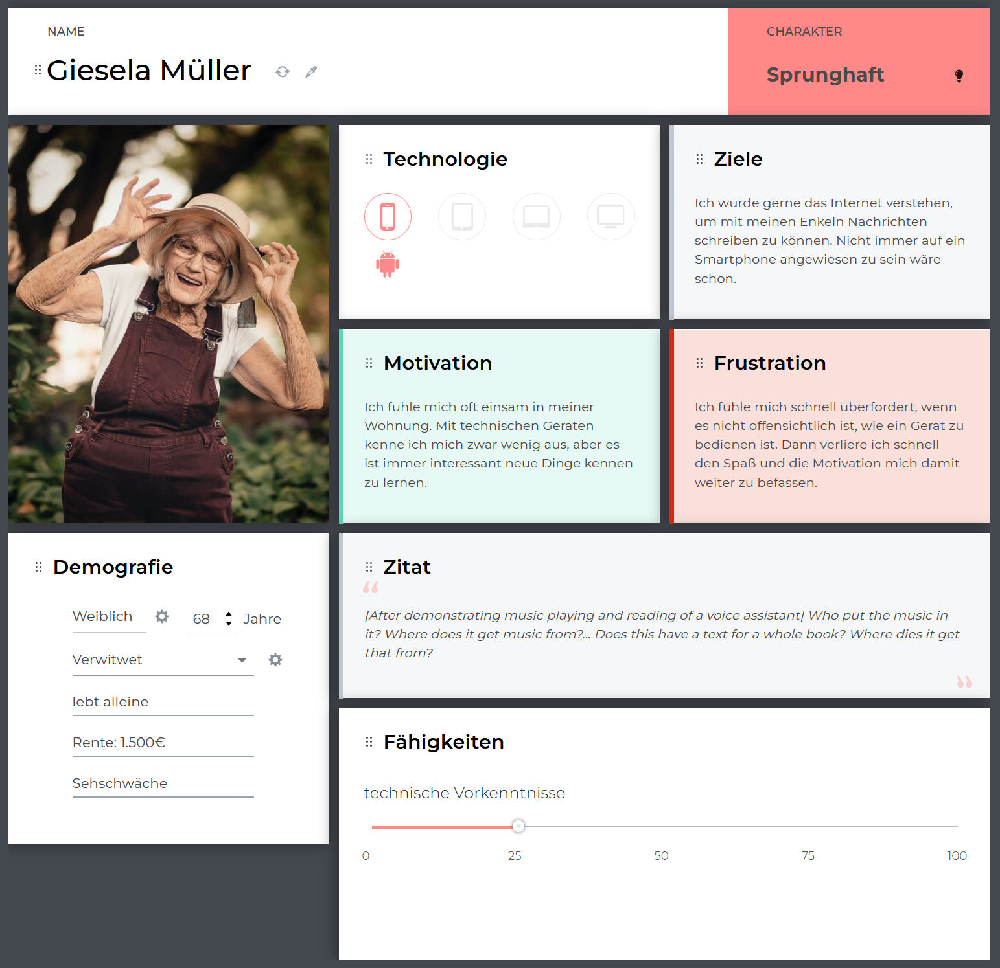

:toc: macro
:toc-title: Inhaltsvezeichnis
:project_name: Individualisierbare Sprachinteraktion

= {project_name}: Forschungsteil 

// Anmerkung:
// Das Dokument befindet sich noch in Arbeit und dient zunächst primär der Informationssammlung

== Aufgabenstellung und Zielsetzung
Analyse und Forschung zur Entwicklung eines, für die Zielgruppe älterer Menschen
anwendbaren, Adaptionskonzepts für Sprachinteraktion basierend auf der Konfiguration von Feature-Modellen und der Konfigurationsauswahl durch ein Recommender-System.

== Abstract

== Inhaltsverzeichnis
toc::[]
:numbered:

== Einleitung

=== Motivation und Ziel
VAs könnten den Alltag von Senioren in vielerlei Hinsichten verbessern. Durch ihre hand und augen freie Interaktion eignen sie sich besonders um sich gut an die Bedürfnisse von Senioren anpassen zu lassen. Trotz vieler Vorteile werden sie oft abgelehnt. Daher soll ein adaptives Konzept entwickelt werden, welches der Zielgruppe die Annahme des VAs erleichtern soll

Ziel ist die Analyse der Zielgruppe sowie ihre Anforderungen ein ein sprachbasiertes Interaktionsmedium, um dieses in ihren Altag zu integrieren

=== Aufbau
Schaffung eines einheitlichen Kontext. Analyse der Zielgruppe. Erarbeitung der Anforderungen an ein solches System

== Hintergrund
Was sind Sprachassistenten?

Weshalb werden diese von älteren Menschen abgelehnt?

== Spezifikation der Zielgruppe 
Senioren sind keine homogene Gruppe. Sie unterscheiden sich stark in fundamentalen Dingen, wie Einkommen, Bildung, Gesundheit, oder Interessen. Daher müssen viele Faktoren betrachtet werden um die Gruppe zu definieren.

=== User Model
20-22% der Bevölkerung in Deutschland über 65
https://www.destatis.de/EN/Service/Statistics-Visualised/age-pyramid-germany.html (Altersschnitt)
https://www.destatis.de/DE/Presse/Pressemitteilungen/2022/09/PD22_N061_12_13.html (Einkommen)
.Characteristics older adults
[cols="1, 1"]
|===
|Alter
|≥ 65

|Geschlecht
a| * männlich
   * weiblich 

|technische Vorkenntnisse
a| * keine 
   * wenig 
   * durchschnittlich
   * viel

|Einkommen
a| * wenig Rente
   * durchschnittliche Rente
   * viel Rente / Rücklagen

|Wohnsituation
a| * alleine
   * mit Partner
   * mit Familie
   * im Heim

|Familienstand
a| * ledig/ verwitwet
   * verheiratet

|sozialer Support
a| * keiner
   * wenig
   * viel

|physische Funktionen
a| * vollständig
   * eingeschränkte Beweglichkeit
   * ...

|kognitive Funktionen
a| * vollständig
   * Dement

|sensorische Funktionen
a| * vollständig
   * Sehschwäche (leicht - blind)
   * Hörschwäche (leicht - taub)

|medizinische Hilfsmittel
a| * Hörgeräte
   * Brille
   * usw...
|===

=== Personas

image::graphics/Persona-2.png[]

_Exploring How Older Adults Use a Smart Speaker–Based Voice Assistant in Their First Interactions: Qualitative Study_

== Features des Sprachassistenten
=== Stimme
Muss anpassbar sein, häufig wird männlich, tiefe Tonlage, natürlich bevorzugt. Je nach Anwendung oder persönlicher Präferenz allerdings anders.

==== Geschlecht
Männlich als default, oft bevorzugt vor Weiblich

==== Tonlage
Tiefere Tonlagen besser verständlich, vor allem bei Senioren mit Hörschädigung. 

==== Art
Natürliche Stimme als default, da bevorzugt

==== Lautstärke
ISO/IEC Guide 71, s.79, 99, 103-104

=== Spracheigenschaften
=== Pause zwischen den Sätzen

=== Sprechgeschwindigkeit
ISO/IEC Guide 71, s.43

=== Satzkomplexität

=== vereinfachter Ausdruck

=== Kommunikationsstil
==== Sprache

==== Gesprächsorientierung

==== Anrede

=== alternative Keywords

== Variabilitätsmodell
image::graphics/FeatureModel.png[]
image::graphics/ConfigEx.png[]

== Zusammenfassung

== Fazit

== Ausblick

    
